# 🏛️ Eko Architecture & Systems Design

This document is a comprehensive, ground-truth architectural reference for **Eko** — derived directly from the source code. It covers every layer: CLI, concurrency engines, AI abstraction, storage schema, CI/CD, data flows, and error handling contracts.

---

## Table of Contents

1. [High-Level System Overview](#1-high-level-system-overview)
2. [Package Dependency Graph](#2-package-dependency-graph)
3. [CLI Command Layer](#3-cli-command-layer)
4. [Worker-Pool Concurrency Engine](#4-worker-pool-concurrency-engine)
5. [Lock-Free Atomic Restore](#5-lock-free-atomic-restore-cas)
6. [AI Provider Abstraction & Fallback Chain](#6-ai-provider-abstraction--fallback-chain)
7. [Diff & ChangeSet Engine](#7-diff--changeset-engine)
8. [Storage Layer & SQLite Schema](#8-storage-layer--sqlite-schema)
9. [Filesystem Layout](#9-filesystem-layout)
10. [End-to-End Sequence: `eko save --ai`](#10-end-to-end-sequence-eko-save---ai)
11. [End-to-End Sequence: `eko restore`](#11-end-to-end-sequence-eko-restore)
12. [End-to-End Sequence: `eko clean`](#12-end-to-end-sequence-eko-clean)
13. [Error Handling & Fallback Strategy](#13-error-handling--fallback-strategy)
14. [CI/CD Pipeline](#14-cicd-pipeline)
15. [Environment Variable Lifecycle](#15-environment-variable-lifecycle)

---

## 1. High-Level System Overview

Eko is structured into four decoupled layers that communicate only through well-defined interfaces.

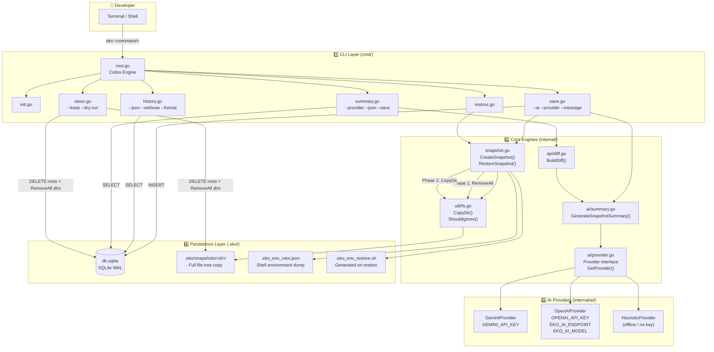

---

## 2. Package Dependency Graph

Shows which packages import which — no circular dependencies.

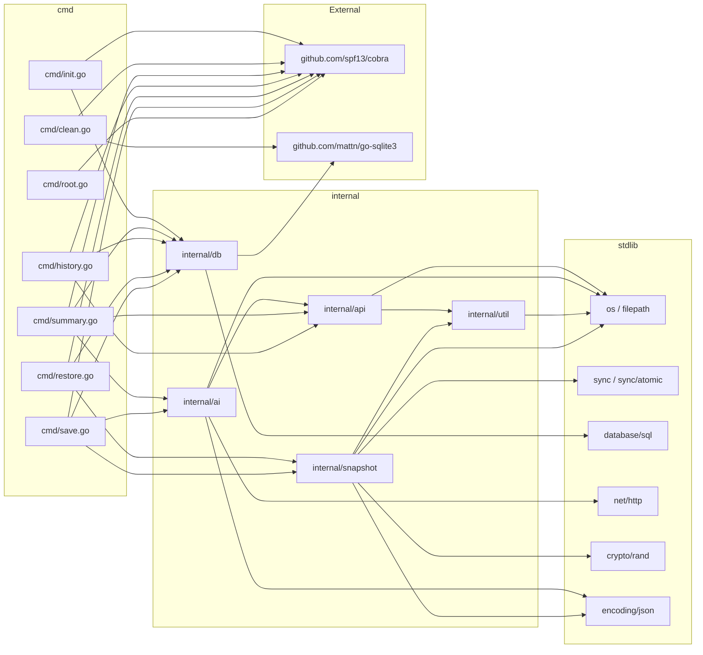

---

## 3. CLI Command Layer

Every subcommand, its flags, and what internal function it calls.

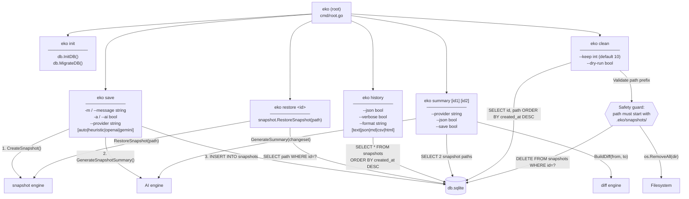

---

## 4. Worker-Pool Concurrency Engine

`internal/util/fs.go` — `CopyDir()` uses a **serial directory walk + parallel file copy** pattern.

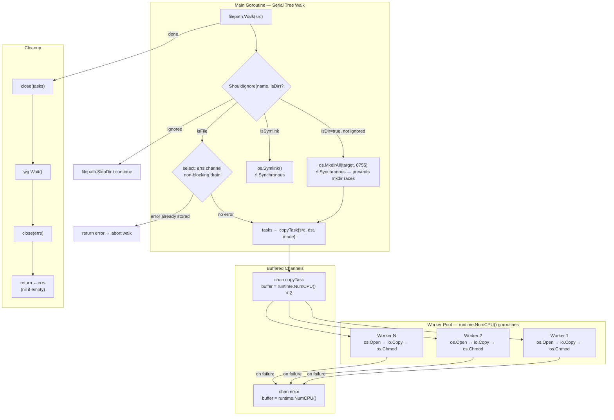

**Key design decisions:**
| Decision | Reason |
|----------|--------|
| Serial `filepath.Walk` | Parent dirs must exist before workers write into them |
| Buffered task channel `NumCPU×2` | Keeps workers fed without blocking the walker |
| Non-blocking error check in walk | Fails fast — stops enqueuing if a worker already died |
| `close(errs)` drain | `←errs` returns `nil` on empty closed channel safely |

---

## 5. Lock-Free Atomic Restore (CAS)

`internal/snapshot/snapshot.go` — `RestoreSnapshot()` uses `atomic.Pointer[error]` for lock-free first-error capture during parallel deletion.

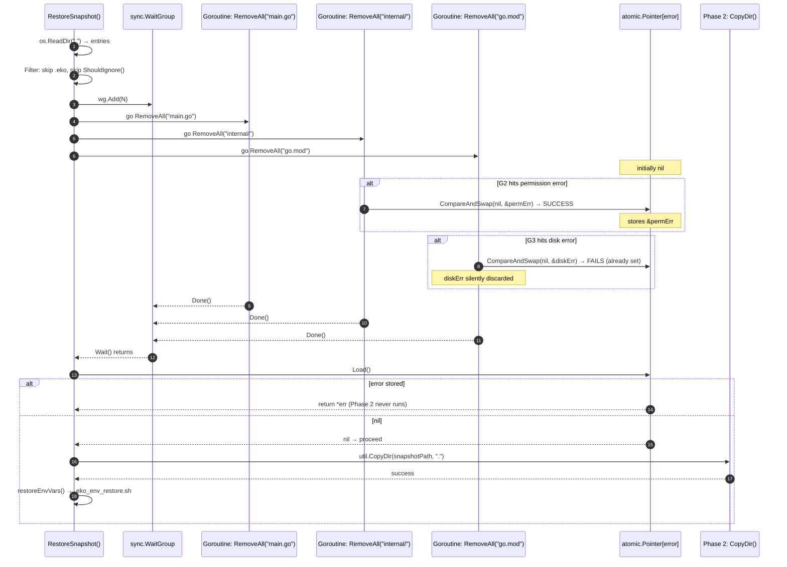

---

## 6. AI Provider Abstraction & Fallback Chain

`internal/ai/provider.go` — `GetProvider()` and all three concrete providers.

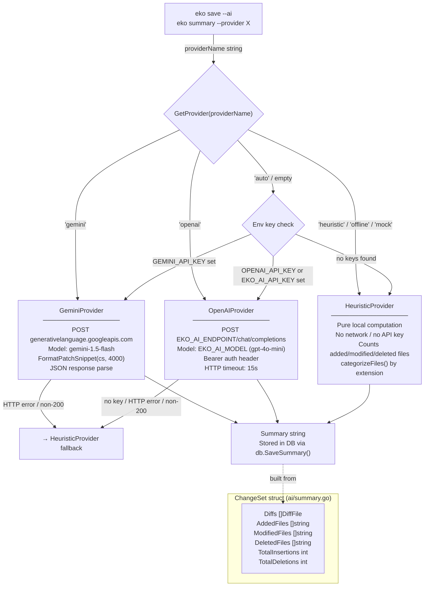

---

## 7. Diff & ChangeSet Engine

`internal/api/diff.go` + `internal/ai/summary.go` — how file diffs are computed and passed to the AI layer.

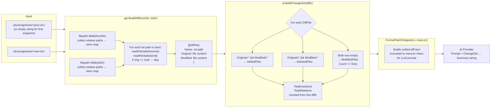

---

## 8. Storage Layer & SQLite Schema

`internal/db/db.go` — schema, migrations, and all query patterns used across commands.

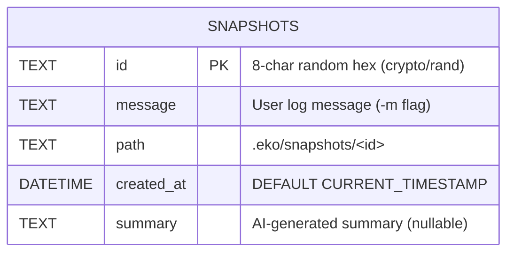

**Query patterns by command:**

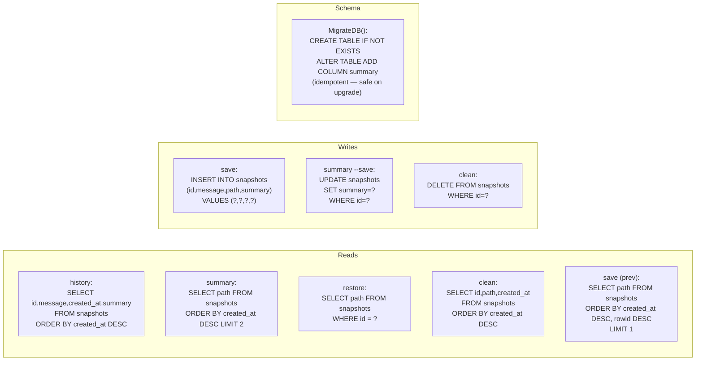

**SQLite connection modes used by `eko clean`:**

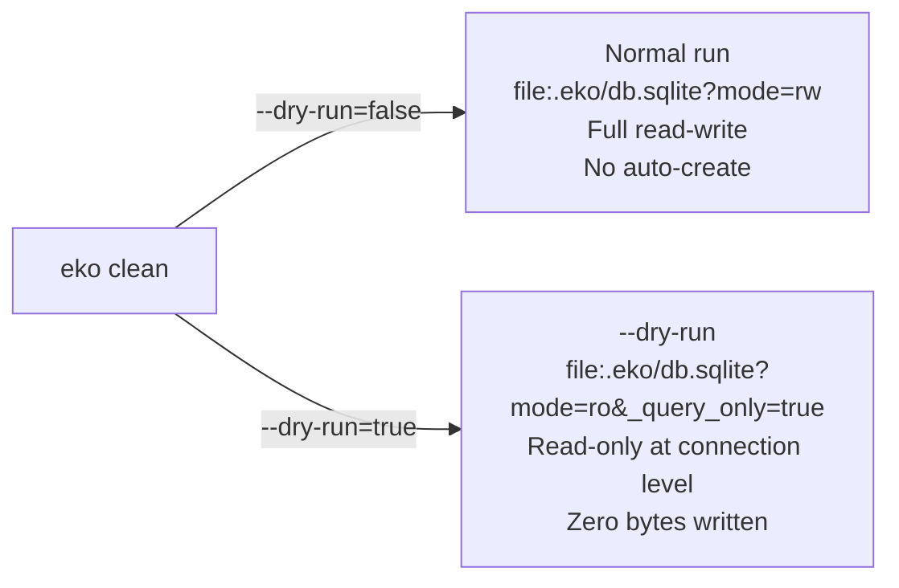

---

## 9. Filesystem Layout

Complete map of every file Eko reads, writes, or manages.

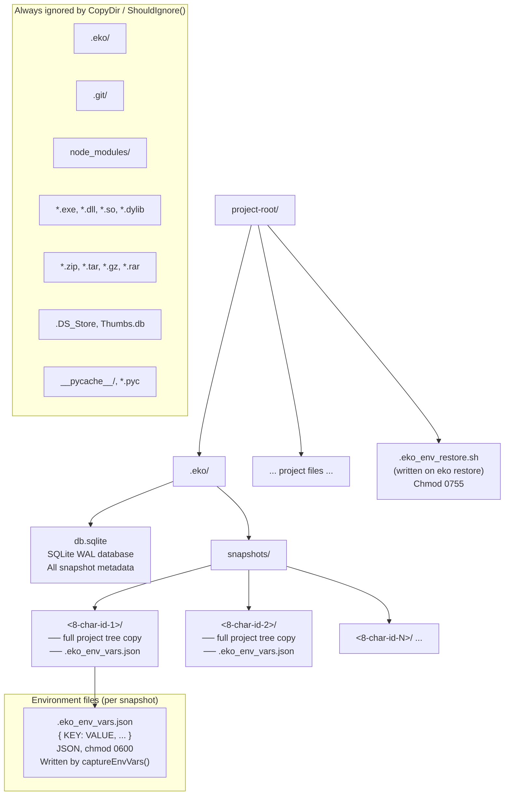

---

## 10. End-to-End Sequence: `eko save --ai`

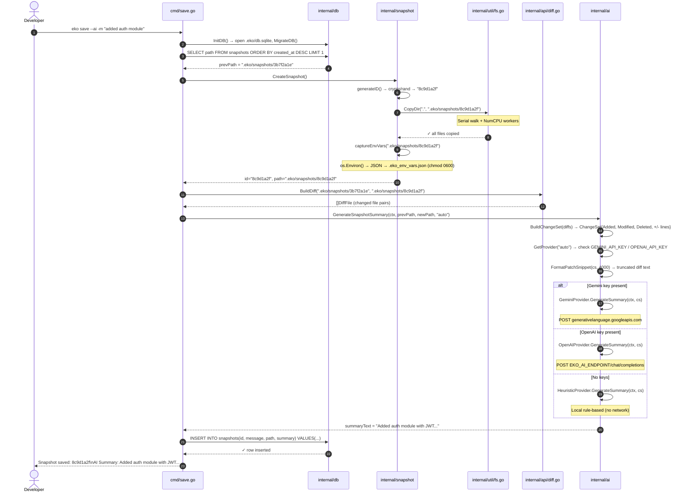

---

## 11. End-to-End Sequence: `eko restore`

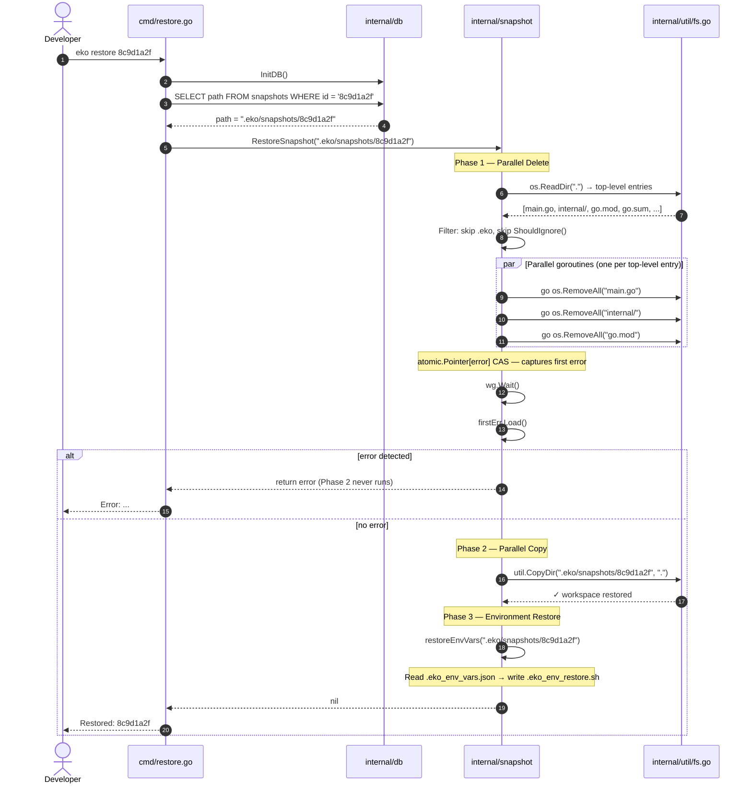

---

## 12. End-to-End Sequence: `eko clean`

```mermaid
sequenceDiagram
    autonumber
    actor Dev as Developer
    participant CLI as cmd/clean.go
    participant DB  as SQLite
    participant Guard as Safety Validator
    participant FS  as os.RemoveAll

    Dev->>CLI: eko clean --keep 5 --dry-run

    CLI->>DB: openCleanDB(readOnly=true)\nDSN: mode=ro&_query_only=true

    CLI->>DB: SELECT id, path, created_at\nFROM snapshots\nORDER BY created_at DESC

    Note over CLI: First 5 rows = KEEP\nRemaining rows = candidates

    loop For each candidate row
        CLI->>Guard: Validate path prefix
        Note over Guard: path MUST start with ".eko/snapshots/"
        Guard->>Guard: filepath.Abs(path)\nstrings.HasPrefix check

        alt path is suspicious (not in .eko/snapshots/)
            Guard-->>CLI: abort — refuse to delete
        else path missing on disk
            Note over CLI: mark missing=true\nskip RemoveAll\nstill delete DB row
        else valid path on disk
            alt dry-run = true
                CLI-->>Dev: [DRY RUN] would delete: &lt;id&gt; (&lt;date&gt;)
            else dry-run = false
                CLI->>FS: os.RemoveAll(".eko/snapshots/&lt;id&gt;")
                FS-->>CLI: ✓
                CLI->>DB: DELETE FROM snapshots WHERE id = ?
                DB-->>CLI: ✓
            end
        end
    end

    CLI-->>Dev: Removed N snapshot(s). Kept 5.
```

---

## 13. Error Handling & Fallback Strategy

```mermaid
flowchart TD
    subgraph AI["AI Layer Fallbacks"]
        Req["API Request"] --> NetOK{"HTTP OK?"}
        NetOK -->|"200"| Parse["Parse JSON response"]
        NetOK -->|"non-200 / timeout / no key"| Fallback["→ HeuristicProvider\n(always succeeds offline)"]
        Parse -->|"malformed"| Fallback
    end

    subgraph FS["Filesystem Layer"]
        Copy["CopyDir()"] --> WErr{"Walk error?"}
        WErr -->|"yes"| RetWalk["return walkErr (priority)"]
        WErr -->|"no"| WrkErr{"Worker error?"}
        WrkErr -->|"yes"| RetWork["return first worker err"]
        WrkErr -->|"no"| RetNil["return nil"]
    end

    subgraph Restore["Restore Layer"]
        Phase1["Phase 1: Parallel Delete"] --> CASErr{"firstErr.Load()?"}
        CASErr -->|"non-nil"| AbortP2["return error\nPhase 2 never runs\n(workspace partially deleted\nbut .eko intact)"]
        CASErr -->|"nil"| Phase2["Phase 2: CopyDir()"]
    end

    subgraph Clean["Clean Safety Guards"]
        PathCheck{"path starts with\n.eko/snapshots/?"} -->|"no"| HardAbort["return error\nzero deletions"]
        PathCheck -->|"yes"| DirCheck{"dir exists?"}
        DirCheck -->|"missing"| StaleRow["delete DB row only\nskip RemoveAll"]
        DirCheck -->|"exists"| SafeDel["RemoveAll + DELETE"]
    end

    subgraph DB["DB Layer"]
        Init["InitDB()"] --> Open["sql.Open()"]
        Open --> Migrate["MigrateDB()\nCREATE TABLE IF NOT EXISTS\nALTER TABLE ADD COLUMN\n(idempotent)"]
        Migrate -->|"error"| Warn["log.Printf warning\ndo NOT fatal — allow degraded mode"]
    end
```

---

## 14. CI/CD Pipeline

```mermaid
flowchart TD
    subgraph Triggers["Triggers"]
        Push["git push → any branch ≠ main"]
        PushMain["git push → main"]
        PR["Pull Request → main"]
        IssueEvent["Issue opened/closed/labeled"]
        TagPush["git tag v*"]
        Manual["workflow_dispatch\n(manual trigger)"]
    end

    subgraph AutoPR[".github/workflows/auto-pr.yml"]
        APR1["Checkout"]
        APR2["Derive PR title\nfrom branch name\nfeat/foo → feat: foo"]
        APR3{"PR already\nexists?"}
        APR4["gh pr create\n--base main\n--title ...\n--body checklist"]
        APR5["Skip"]
    end

    subgraph CI[".github/workflows/ci.yml"]
        CI1["actions/checkout@v4"]
        CI2["actions/setup-go@v5\ngo-version: 1.26"]
        CI3["go build -v ./..."]
        CI4["go test -v ./..."]
    end

    subgraph Badge[".github/workflows/update-badge.yml"]
        B1["gh issue list\n--label 'good first issue'\n--state open\n--jq length"]
        B2{"Badge count\nchanged?"}
        B3["sed -i replace count\nin README.md"]
        B4["git commit [skip ci]\ngit push"]
        B5["No-op"]
    end

    subgraph Release[".github/workflows/release.yml"]
        R1["goreleaser\nCross-platform binaries\nlinux/darwin/windows\namd64/arm64"]
        R2["GitHub Release\nwith checksums"]
    end

    Push --> AutoPR
    APR1 --> APR2 --> APR3
    APR3 -->|"no"| APR4
    APR3 -->|"yes"| APR5

    PushMain & PR --> CI
    CI1 --> CI2 --> CI3 --> CI4

    IssueEvent & Manual --> Badge
    B1 --> B2 -->|"changed"| B3 --> B4
    B2 -->|"same"| B5

    TagPush --> Release
    R1 --> R2
```

---

## 15. Environment Variable Lifecycle

How shell environment is captured, stored, and restored across `eko save` / `eko restore`.

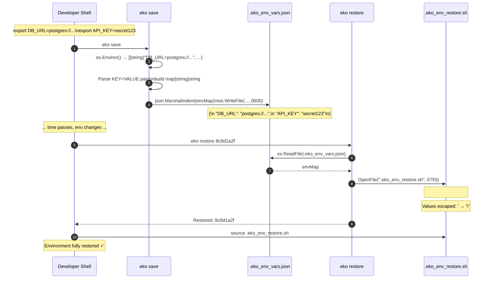

---

*Architecture document generated from live source code — `internal/snapshot/snapshot.go`, `internal/util/fs.go`, `internal/db/db.go`, `internal/ai/provider.go`, `internal/api/diff.go`, `cmd/*.go`.*
