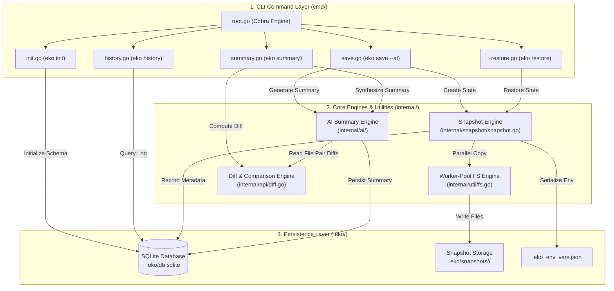
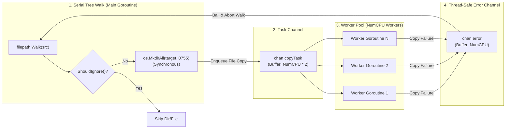
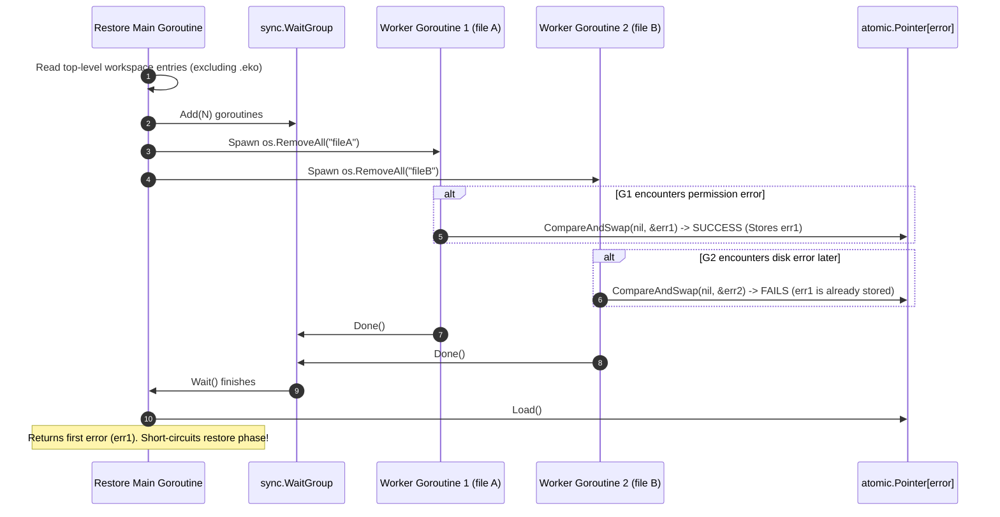
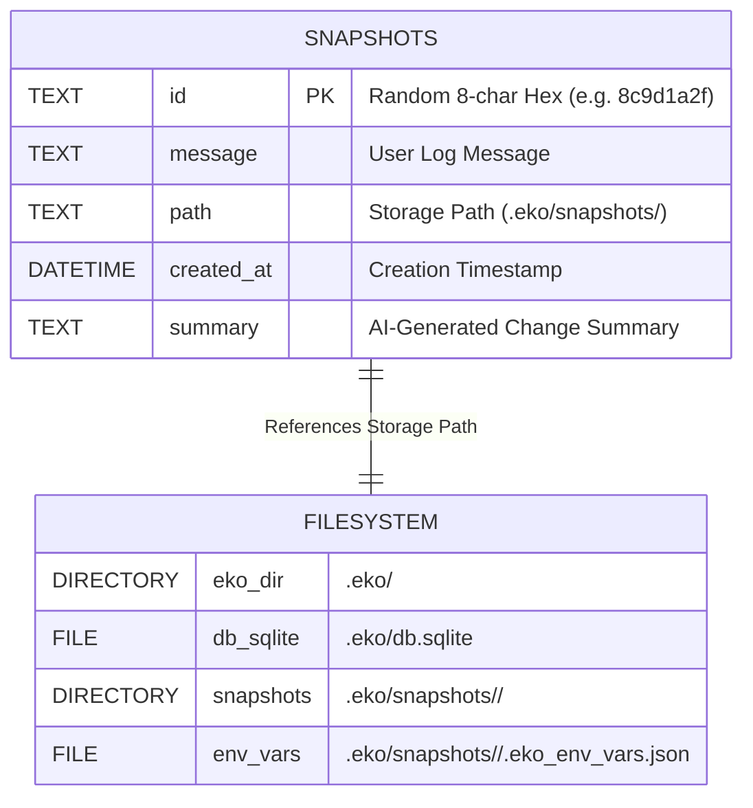
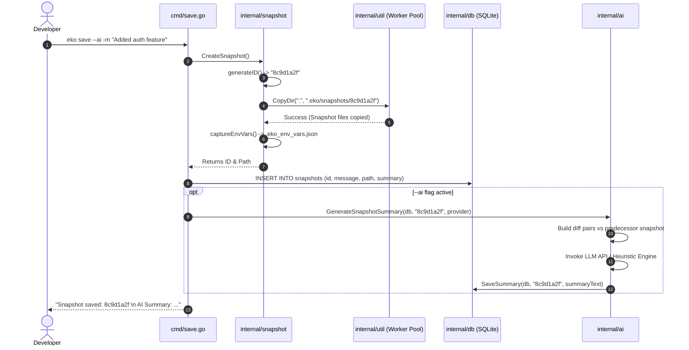
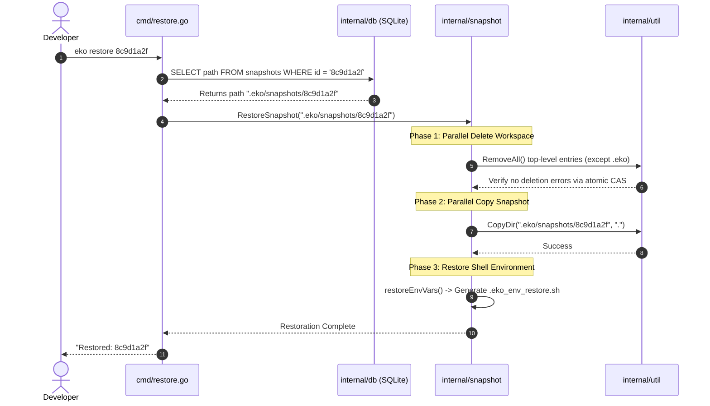

# 🏛️ Eko Architecture & Systems Design

This document provides a deep, comprehensive visual tour of **Eko's** system architecture, concurrency engine, storage schemas, and execution workflows.

---

## 1. High-Level System Architecture

Eko is structured into three decoupled layers: **CLI Command Layer**, **Core Systems & AI Engines**, and **Storage & Persistence Layer**.



---

## 2. Component Cell Diagrams

### Cell Diagram 1: Worker-Pool Concurrency Engine (`internal/util/fs.go`)

Eko processes directory copying using a hybrid **Serial Directory Tree Walk + Parallel Worker Pool** design.
- **Why Serial Walk?** Walking the directory structure serially guarantees that parent directories are created on disk *before* parallel workers try to write files into them, preventing filesystem race conditions.
- **Why Worker Pool?** A fixed pool of `runtime.NumCPU()` worker goroutines saturates both CPU cores and disk I/O bandwith.



---

### Cell Diagram 2: Lock-Free Atomic Compare-And-Swap (CAS) Restore (`internal/snapshot/snapshot.go`)

When `eko restore` is executed, existing workspace entries must be removed before the snapshot files are copied back.
To perform parallel deletion safely without mutex lock contention, Eko utilizes Go 1.19+ **`atomic.Pointer[error]`** lock-free Compare-And-Swap (CAS).



---

### Cell Diagram 3: AI Provider Abstraction Engine (`internal/ai/`)

Eko supports multi-provider LLM summary generation with automatic fallback:
- **`Google Gemini Provider`** (`GEMINI_API_KEY`)
- **`OpenAI / Custom LLM Provider`** (`OPENAI_API_KEY` or `EKO_AI_API_KEY`)
- **`Local Heuristic Provider`** (Offline fallback using diff metrics)

```mermaid
graph TD
    Client["eko summary / eko save --ai"] -->|Request Summary| Engine["GenerateSnapshotSummary()"]
    Engine --> ProviderSelect{"Select Provider?"}

    ProviderSelect -->|--provider gemini| Gemini["GeminiProvider\n(Google Gemini API)"]
    ProviderSelect -->|--provider openai| OpenAI["OpenAIProvider\n(OpenAI / Custom LLM)"]
    ProviderSelect -->|--provider heuristic| Local["HeuristicProvider\n(Offline Rule Engine)"]
    ProviderSelect -->|Auto (Default)| AutoCheck{"API Keys Present?"}

    AutoCheck -->|GEMINI_API_KEY set| Gemini
    AutoCheck -->|OPENAI_API_KEY set| OpenAI
    AutoCheck -->|No API keys| Local

    Gemini -->|Prompt Engineering & JSON Format| Response["Summary Result Struct"]
    OpenAI -->|Prompt Engineering & JSON Format| Response
    Local -->|Extract Added/Deleted Metrics| Response

    Response -->|Update Database| DB[(".eko/db.sqlite")]
```

---

## 3. Storage & Database Schema Cell Diagram

All snapshot records and metadata are persisted locally in `.eko/db.sqlite`:



---

## 4. End-to-End Sequence Diagrams

### Sequence 1: `eko save --ai` Execution Flow



---

### Sequence 2: `eko restore <snapshot-id>` Execution Flow


