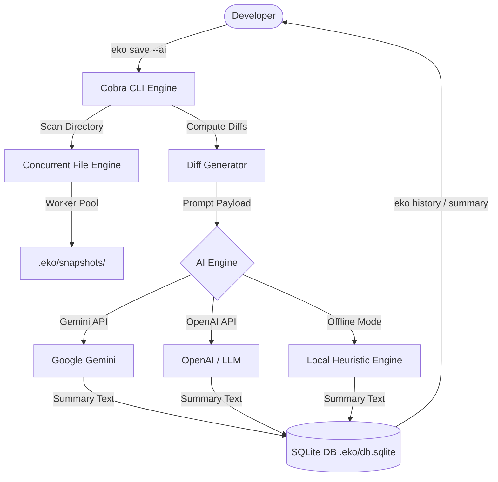

<p align="center">
  
</p>

<h1 align="center">Eko ✦ Next-Gen Workspace Time Machine</h1>

<p align="center">
  <b>AI-Powered, High-Performance Directory State Snapshot & Versioning CLI in Go.</b>
</p>

<p align="center">
  <a href="https://goreportcard.com/report/github.com/kavix/eko"></a>
  <a href="https://github.com/kavix/eko/actions/workflows/ci.yml"></a>
  <a href="https://opensource.org/licenses/MIT"></a>
  <a href="GOOD_FIRST_ISSUES.md"></a>
  <a href="CONTRIBUTING.md"></a>
</p>

<p align="center">
  <a href="https://kavix.github.io/eko"><b>🌐 Documentation Website</b></a> •
  <a href="guide.md"><b>📖 User Guide</b></a> •
  <a href="GOOD_FIRST_ISSUES.md"><b>🌟 Good First Issues</b></a> •
  <a href="CONTRIBUTING.md"><b>🤝 Contributing</b></a>
</p>

---

## ⚡ What is Eko?

**Eko** is an ultra-fast, concurrent local directory state versioning CLI written in Go. It acts as an instant local "Time Machine" for software projects, allowing developers to capture, inspect, diff, and restore directory states atomically.

Unlike conventional backup tools, Eko features **AI-powered change analysis** (powered by **Google Gemini**, **OpenAI**, or an offline local **heuristic engine**) that reads filesystem diffs and writes intelligent, human-readable snapshot change summaries automatically.

```text
       ┌──────────────┐         ┌─────────────────────────┐         ┌───────────────────────┐
       │  Workspace   │ ──────> │  Concurrent Worker Pool │ ──────> │ Local SQLite Storage  │
       │ Directory    │         │  (Parallel Copy & CAS)  │         │ (.eko/db.sqlite)      │
       └──────────────┘         └─────────────────────────┘         └───────────────────────┘
                                             │
                                             ▼
                                ┌─────────────────────────┐
                                │  AI Change Summaries    │
                                │ (Gemini/OpenAI/Offline) │
                                └─────────────────────────┘
```

---

## ✨ Features

- 🤖 **AI-Powered Change Summaries:** Automatically analyze code diffs and generate intelligent snapshot summaries using **Gemini**, **OpenAI**, or offline heuristic fallbacks.
- ⚡ **Concurrent Worker-Pool Engine:** Instantly copy and store directory snapshots using Go's worker-pool concurrency model.
- 🔒 **Atomic Restores with Lock-Free CAS:** Safely revert workspace states using Compare-And-Swap (`atomic.Pointer`) error handling safeguards.
- 💾 **Zero-Dependency Local SQLite Storage:** All snapshot metadata, diff histories, and AI summaries are saved locally inside `.eko/db.sqlite`.
- 🔍 **Diff Comparison & Log Analytics:** Instantly calculate and inspect file modifications between any two snapshot points.
- 🛡️ **Built-In Ignore Rules:** Automatically ignores binary artifacts, `.git`, `.eko`, `node_modules`, and temporary build files.

---

## 📊 Why Eko? (Comparison)

| Feature | ✦ **Eko** | **Git Stash** | **Manual Zip/Copy** | **OS Time Machine** |
| :--- | :---: | :---: | :---: | :---: |
| **Instant Local Snapshots** | ✅ Sub-second | ✅ Fast | ❌ Slow | ❌ Minute Intervals |
| **AI Change Summaries** | ✅ Gemini / OpenAI / Local | ❌ No | ❌ No | ❌ No |
| **Runs Independent of Git** | ✅ Yes | ❌ Requires Git | ✅ Yes | ✅ Yes |
| **Structured SQLite Querying**| ✅ Yes | ❌ No | ❌ No | ❌ No |
| **Lock-Free Concurrency** | ✅ Go Worker Pool | ❌ Serial | ❌ Serial | ❌ OS Background |

---

## 🚀 Quick Start

### Installation

#### 1. Homebrew (macOS)
```bash
brew tap kavix/tap
brew install eko
```

#### 2. Build From Source (Requires Go 1.21+)
```bash
git clone https://github.com/kavix/eko.git
cd eko
go build -o eko .
```

---

## 💻 CLI Usage Guide

### 1. Initialize Eko
Initialize Eko in any local project directory. This creates `.eko/` with an embedded SQLite database:
```bash
eko init
```

### 2. Save a Snapshot
Capture the current filesystem state in milliseconds:
```bash
eko save

# Save and auto-generate an AI change summary:
eko save --ai
```

### 3. Generate AI Summaries
Analyze snapshot changes using Gemini, OpenAI, or local offline heuristics:
```bash
# Summarize changes in the latest snapshot vs predecessor
eko summary

# Summarize changes between two specific snapshot IDs
eko summary 3b7f2a1e 8c9d1a2f

# Force specific AI provider and output JSON format
eko summary --provider gemini --json
```

#### AI Provider Credentials (Optional)
- **Google Gemini**: Set `GEMINI_API_KEY`
- **OpenAI / Custom LLM**: Set `OPENAI_API_KEY` or `EKO_AI_API_KEY` (Supports custom endpoints via `EKO_AI_ENDPOINT`)
- **Offline / Local Fallback**: Automatically uses local heuristic rules if no API key is set!

### 4. View History Log
List all recorded snapshots along with creation timestamps and change summaries:
```bash
eko history

# Verbose history mode:
eko history --verbose
```

### 5. Restore Previous State
Atomically revert your current directory state to any historical snapshot point:
```bash
eko restore <snapshot-id>
```

---

## 🏗️ Architecture

Eko is built with Go's standard library and Cobra CLI framework for maximum performance and zero external daemon dependencies:



---

## 🌟 Contributing & Good First Issues

We welcome open-source contributions! Whether you're fixing a typo, adding documentation, or building a core CLI command, your help is appreciated.

> 🎓 **Looking for your first issue?** We maintain a dedicated list of beginner-friendly tasks with step-by-step guides in **[GOOD_FIRST_ISSUES.md](GOOD_FIRST_ISSUES.md)**!

1. Check out **[GOOD_FIRST_ISSUES.md](GOOD_FIRST_ISSUES.md)** to pick a task.
2. Read our **[CONTRIBUTING.md](CONTRIBUTING.md)** for architecture & coding guidelines.
3. Submit a Pull Request targeting `main`.

---

## ⭐️ Support & Community

If you find **Eko** helpful or exciting, please consider giving us a **⭐️ Star on GitHub**! Star counts help open-source projects gain visibility and attract active maintainers.

<p align="center">
  <a href="https://github.com/kavix/eko">
    
  </a>
</p>

---

## 📄 License

This project is open-source software licensed under the **[MIT License](LICENSE)**.
