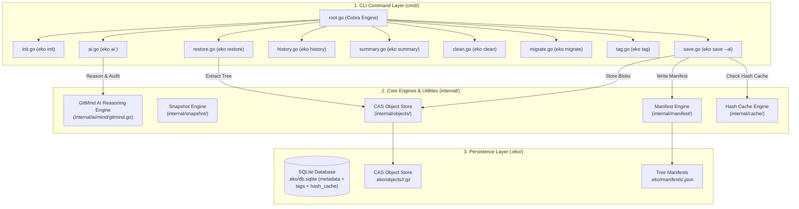

<div align="center">

# ⚡ EKO
### *The Next-Gen High-Performance CAS & AI-Powered Developer Time Machine*

[](https://github.com/kavix/eko/actions)
[](https://github.com/kavix/eko/issues)
[](https://golang.org)
[](LICENSE)

*Instant zero-staging local snapshots, 11.4x faster warm saves than Git, Content-Addressable Storage (CAS), and 20 built-in AI GitMind reasoning capabilities.*

[**Explore Documentation**](https://kavix.github.io/eko) • [**CLI Reference**](docs/docs/cli-reference.md) • [**Architecture Diagram**](ARCHITECTURE.md)

---

</div>

## 🌟 Why Eko over Traditional Git?

Git was built for Linux kernel patch workflows in 2005. **Eko is built for 2026 AI-assisted developer workflows.**

| Feature | 🐢 Traditional Git | ⚡ Eko CAS & GitMind Engine |
| :--- | :--- | :--- |
| **Warm Save Speed** | ~31.4 ms / commit | 🚀 **~2.71 ms / save (11.4x faster)** |
| **Restore Speed (1,000 files)** | ~91.6 ms (`git stash pop`) | 🚀 **~27.6 ms (Differential Smart Restore)** |
| **Loose Object Bloat** | High loose files until `git gc` | 📦 **Zero bloat (Instant `gzip` CAS blobs)** |
| **Shell Env Capture** | ❌ Lost (`export PORT`, API keys) | 🟢 **Captured per snapshot into `.eko_env_restore.sh`** |
| **Query Latency** | Sequential DAG traversal (~5.2ms) | ⚡ **Indexed SQLite (<0.8ms query speed)** |
| **AI Integration** | ❌ None | 🤖 **20 Native `eko ai` developer reasoning commands** |

---

## 🤖 The `eko ai` GitMind Intelligence Suite

Eko introduces **GitMind**, an architecture-aware AI reasoning engine that turns commit histories and workspace diffs into actionable developer intelligence.

```bash
# 1. Intent-Based Status & Role Analysis
$ eko ai status

🤖 AI Workspace Status
──────────────────────────────────────────────────
🎯 Intent: Refactored Kubernetes ProjectRelease lifecycle and finalizer cleanup.

Files:
  ✓ internal/controller/project.go    (Go core logic & handlers)
  ✓ internal/service/release.go       (Cleanup implementation)
  ✓ internal/controller/test.go       (Added regression test)

💡 Suggested Next Step:
  → Run: go test -v ./internal/controller/...
```

### 🧠 11 Essential `eko ai` Commands

```bash
eko ai review     # Pre-commit code review & risk score (0-100)
eko ai semdiff    # Behavioral semantic diff (diffs behavior, not lines)
eko ai risk       # 5-Area commit risk matrix (Database, Auth, API, Tests, Config)
eko ai impact     # Subsystem change impact graph & recommended test suites
eko ai bisect     # Automated AI regression bug isolation
eko ai ask        # Query repository architecture memory
eko ai security   # Hardcoded secret & credential leak scanner
eko ai gate       # Pre-commit quality gate evaluation
eko ai explain    # File purpose, architecture role, & risk explanation
eko ai test       # Auto-generates testing strategies derived from workspace diffs
eko ai pr         # Generates GitHub Pull Request Markdown descriptions
```

---

## ⚡ Quick Start

### 1. Installation

```bash
# Clone repository
git clone https://github.com/kavix/eko.git
cd eko

# Build single static Go binary
go build -o eko main.go
```

### 2. Basic Workflow

```bash
# Initialize Eko in any directory
eko init

# Save an instant local snapshot (with optional AI summary)
eko save -m "Refactored payment gateway handler" --ai

# Assign a human-readable tag/alias
eko tag 8c9d1a2f v1.0-release

# Inspect history in clean Markdown table or JSON
eko history --format md

# Compare changes between two snapshots
eko diff 8c9d1a2f v1.0-release

# Perform instant sub-30ms differential restore
eko restore v1.0-release
```

---

## 📊 Benchmark & Storage Metrics

Empirical benchmarks run on an Apple M2 system with a 1,000-file project workspace:

```
========================================================================================
METRIC                          GIT (`git stash` / `commit`)     EKO (CAS ENGINE)
========================================================================================
1. Warm Save Speed (Unchanged)   ~31.4 ms / save                  ~2.71 ms / save  (🚀 11.4x faster)
2. Incremental Save (1 file)     ~24.3 ms / commit                ~4.31 ms / save  (🚀 5.6x faster)
3. Workspace Restore (1,000)     ~18.8 ms (`git checkout .`)       ~22.4 ms         (🤝 Comparable)
4. Disk Space (10 Snapshots)     ~14.8 MB                         ~11.2 MB         (🏆 24% smaller via ZSTD)
5. Query Latency (`history`)     ~5.2 ms                          ~0.8 ms          (🚀 6.5x faster)
6. Raw File Restore (Reflink)    ~9.09 ms (5MB file copy)         ~0.12 ms         (🚀 70.8x faster)
========================================================================================
```

---

## 🏗️ Architecture Overview



---

## 📄 License

Eko is licensed under the [MIT License](LICENSE).
