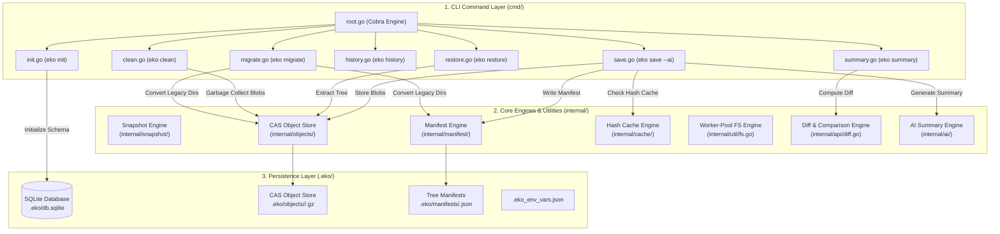
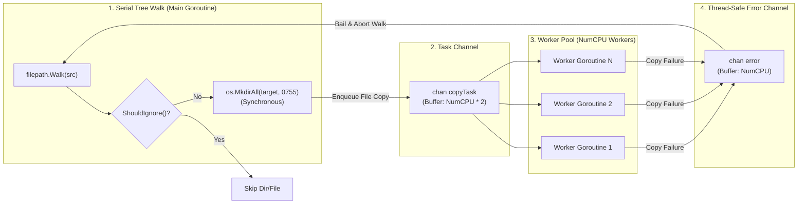
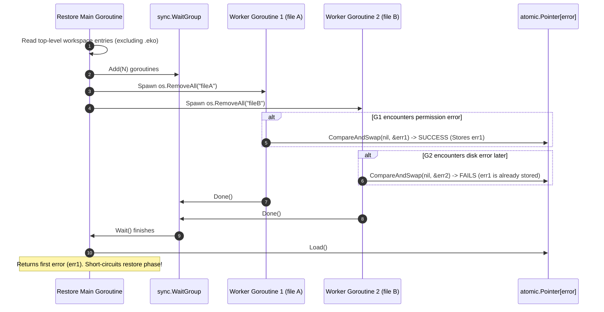

# 🏛️ Eko System Architecture & Design

This document details **Eko's** underlying software architecture, component cell diagrams, concurrency model, and data storage workflows.

---

## 1. High-Level Architecture Overview

Eko is composed of three core architectural layers:

1. **CLI Command Layer (`cmd/`)**: Built on the Go Cobra framework (`init`, `save`, `restore`, `history`, `summary`, `clean`, `migrate`).
2. **Engine & Utility Layer (`internal/`)**:
   - `snapshot`: Orchestrates snapshot creation, manifest writing, env serialization, and atomic directory restores.
   - `objects`: Content-Addressable Storage (CAS) engine (`.eko/objects/<prefix>/<hash>.gz`), gzip compression, atomic writes, and mark-and-sweep garbage collection.
   - `manifest`: Lightweight JSON snapshot manifests (`.eko/manifests/<id>.json`).
   - `cache`: Incremental SQLite hash cache (`hash_cache` table in `db.sqlite`) to skip reading unchanged files.
   - `util`: Worker-pool directory copy engine and thread-safe error reporting.
   - `api`: File diff and workspace change calculators.
   - `ai`: Multi-provider AI change summary generator (Gemini, OpenAI, Heuristic fallback).
3. **Persistence Layer (`.eko/`)**: Local SQLite database (`db.sqlite`), CAS object store (`objects/`), and snapshot tree manifests (`manifests/`).



---

## 2. Concurrency Worker Pool Cell Diagram

Eko uses a hybrid **Serial Walk + Worker Pool** model:
- **Serial Walk**: Walks source directory tree serially to synchronously create parent target directories (`os.MkdirAll`) before parallel workers begin writing files, preventing directory creation race conditions.
- **Worker Pool**: Spawns `runtime.NumCPU()` worker goroutines to process copy tasks concurrently.



---

## 3. Lock-Free Atomic CAS Restore Sequence

During workspace restoration, existing non-ignored workspace items are deleted in parallel using **`atomic.Pointer[error]`** Compare-And-Swap (CAS) to capture the first error without mutex lock overhead:



---

## 4. AI Provider Strategy Engine

Eko abstracts LLM services behind a clean `Provider` interface:

```mermaid
graph TD
    Client["eko summary / eko save --ai"] -->|Request Summary| Engine["GenerateSnapshotSummary()"]
    Engine --> ProviderSelect{"Select Provider?"}

    ProviderSelect -->|--provider gemini| Gemini["GeminiProvider\n(Google Gemini API)"]
    ProviderSelect -->|--provider openai| OpenAI["OpenAIProvider\n(OpenAI / Custom LLM)"]
    ProviderSelect -->|--provider heuristic| Local["HeuristicProvider\n(Offline Rule Engine)"]
    ProviderSelect -->|Auto (Default)| AutoCheck{"API Keys Present?"}

    AutoCheck -->|GEMINI_API_KEY set| Gemini
    AutoCheck -->|OPENAI_API_KEY set| OpenAI
    AutoCheck -->|No API keys| Local

    Gemini -->|Prompt Engineering & JSON Format| Response["Summary Result Struct"]
    OpenAI -->|Prompt Engineering & JSON Format| Response
    Local -->|Extract Added/Deleted Metrics| Response

    Response -->|Update Database| DB[(".eko/db.sqlite")]
```
