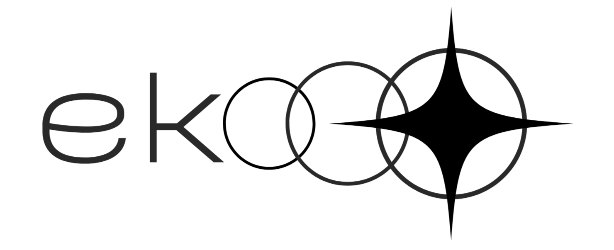

<p align="center">
  
</p>

# Eko User Guide ✦

Eko is an AI snapshot versioning tool designed to capture, inspect, diff, and restore directory states from the command line.

---

## 1. Installation

Eko is a single Go binary. Build it from the repository root:

```bash
git clone https://github.com/kavix/eko.git
cd eko
go build -o eko .
```

Copy the resulting `eko` binary to a folder in your `$PATH` (e.g. `/usr/local/bin/`).

The full command list, including `diff`, `tag`, `clean`, `migrate`, `completion`, and the `eko ai` suite, is in the [CLI Reference](docs/docs/cli-reference.md).

---

## 2. Basic CLI Usage

To use Eko inside any project or directory:

### Step 1: Initialize Eko
Create the hidden SQLite database and backups folder (`.eko/`) in the target directory:
```bash
cd /path/to/your-project
eko init
```
*Output:* `Eko initialized.`

### Step 2: Save a Snapshot
Capture the current state of all files in the directory (excluding the `.eko` folder itself):
```bash
eko save
```
*Output:* `Snapshot saved: <id>` (where `<id>` is a unique 8-character hexadecimal identifier).

You can also auto-generate AI change summaries when saving:
```bash
eko save --ai
```

### Step 3: Generate AI Change Summaries
Inspect AI-generated summaries of changes between snapshots:
```bash
# Summarize changes in the latest snapshot vs predecessor
eko summary

# Summarize changes in a specific snapshot
eko summary 3b7f2a1e

# Summarize changes between two specific snapshots
eko summary 3b7f2a1e 8c9d1a2f

# Output summary as formatted JSON
eko summary --json

# Force a specific provider (auto, heuristic, openai, gemini) and save result to DB
eko summary 3b7f2a1e --provider gemini --save
```

### Step 4: AI Provider Configuration
Eko supports multiple AI summary engines:
- **Auto (default)**: Automatically uses Gemini or OpenAI if credentials are found, otherwise falls back to local heuristic mode.
- **Heuristic / Offline (`-p heuristic`)**: Fast, structured local rule-based analysis (no API key or internet required).
- **OpenAI (`-p openai`)**: Connects to OpenAI API or custom local LLMs (vLLM / Ollama).
- **Gemini (`-p gemini`)**: Connects to Google Gemini API.

#### Environment Variables:
- `GEMINI_API_KEY`: API key for Google Gemini provider.
- `OPENAI_API_KEY` / `EKO_AI_API_KEY`: API key for OpenAI provider.
- `EKO_AI_ENDPOINT`: Custom base URL for OpenAI-compatible LLMs (default: `https://api.openai.com/v1`).
- `EKO_AI_MODEL`: Custom LLM model (default: `gpt-4o-mini` for OpenAI, `gemini-1.5-flash` for Gemini).

### Step 5: View Snapshot History
List all saved snapshots with their creation timestamps and summaries:
```bash
eko history

# Show verbose history with detailed AI summaries
eko history --verbose

# Output history list in JSON format
eko history --json
```

### Step 6: Restore a Previous State
Revert all files in your directory concurrently to the exact state captured in a given snapshot:
```bash
eko restore <snapshot-id>
```
*Example:* `eko restore 3b7f2a1e`
*Output:* `Restored: 3b7f2a1e`
